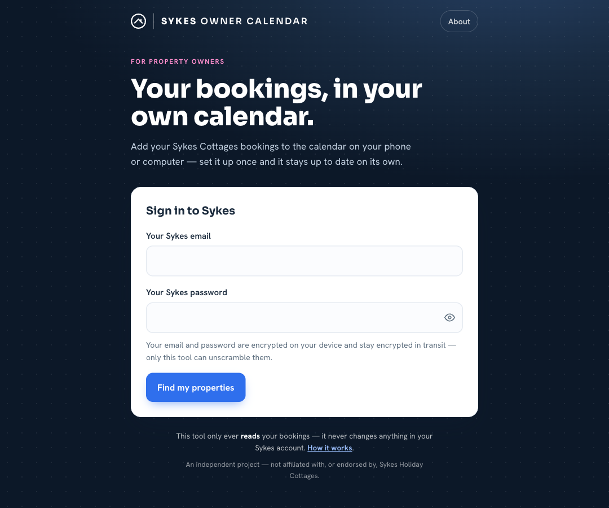
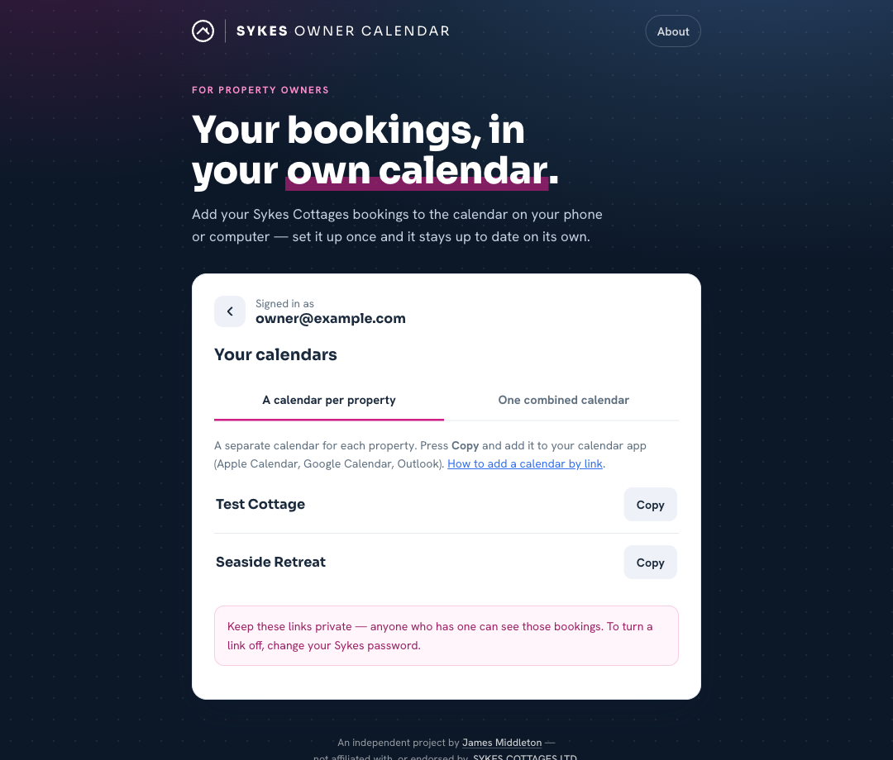

# Sykes Owner Calendar

See all the bookings for your [Sykes Cottages](https://www.sykescottages.co.uk) holiday property in your everyday calendar — the one on your phone, tablet or computer. Once it's set up, your bookings appear on their own and stay up to date, so you can tell at a glance when your property is booked, when guests come and go, and which dates you've kept for yourself.

It works with the calendars most people already use, including **Apple Calendar** (iPhone, iPad and Mac), **Google Calendar** and **Microsoft Outlook**.

## Setting it up

You only do this once. After that, the calendar looks after itself.

1. Go to **[sykes-calendar.midz.dev](https://sykes-calendar.midz.dev)**.
2. Enter the email and password you use to sign in to Sykes. (They're **encrypted on your own device** and stay encrypted in transit — see below.)
3. Press **Find my properties**, then pick how you'd like your calendars:
   - **A calendar per property** — a separate link for each cottage. Recommended: most calendar apps colour-code them, so they're easy to tell apart.
   - **One combined calendar** — everything in a single calendar, with each booking labelled by its property. Leave *Include all my properties* ticked and any cottage you add in future is picked up automatically, or untick it to choose specific ones.
4. Press **Copy** next to the calendar you want.
5. Add it to your calendar app. Adding a calendar this way is sometimes called *subscribing*; [this short guide](https://help.hospitable.com/en/articles/4605516-how-can-i-add-the-ical-feed-to-the-calendar-on-my-device) shows how on the most popular apps — wherever it asks for a calendar address, paste in your link.

That's everything — your bookings will appear, and the calendar will quietly refresh itself from time to time.

## What you'll see

Each entry covers the nights a property is taken. Guest bookings show the guest's name and how many people are coming, the dates you've reserved for yourself appear as your own bookings, and cancelled bookings are marked as cancelled. In a combined calendar, each booking is also labelled with its property, so you can tell your cottages apart.

## Please keep your link private

Your calendar link is like a key to your bookings: **anyone who has it can see them.** So:

- Don't share it, email it around, or post it anywhere public.
- Only add it to your own devices.

The good news is that your password is **encrypted inside the link** — it's never written out in plain text. It's encrypted on your own device and stays encrypted in transit, and only this tool can decrypt it. The tool only *reads* your bookings; it never changes anything in your Sykes account.

**To turn off a link** (say you shared it by accident), just change your Sykes password — every old link stops working straight away. Then make a fresh one with your new password.

---

*An independent project — not affiliated with, or endorsed by, [SYKES COTTAGES LTD](https://www.sykescottages.co.uk/).*

**Building or contributing?** See **[DEVELOPERS.md](DEVELOPERS.md)** — how it works, the routes, scripts, secrets, CI and deployment.
